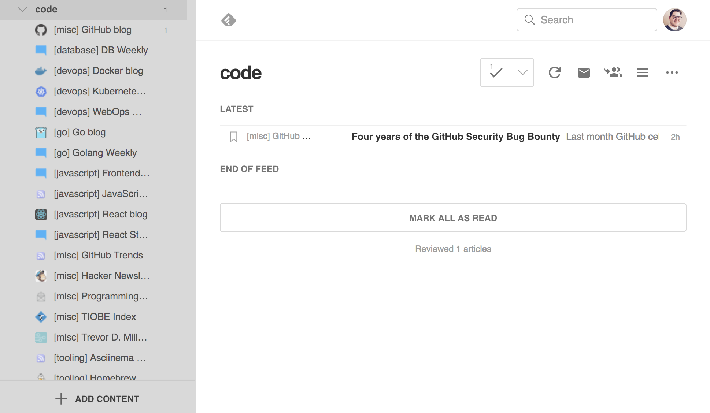
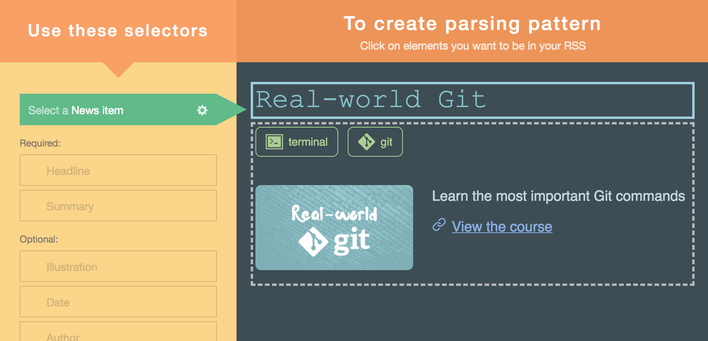
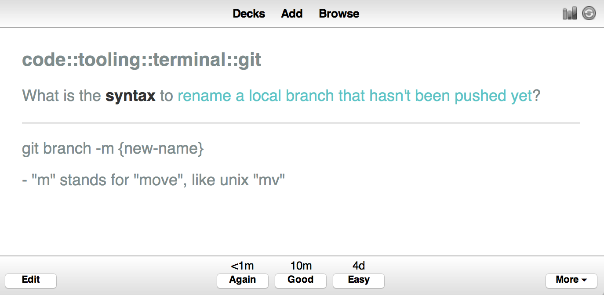

# My approach to lifelong learning

---

# Let's learn to learn


---

# Overview

📖 Learning new things with a feed reader

🧠 Remembering with spaced repetition

🗣 Sharing with social media automation

---

## 📖 Learning new things with a feed reader

I recommend _Feedly_ but any feed reader will work



---

### Add anything that is important to you

Examples:

* Newsletters
* Blogs
* YouTube channels
* Twitter accounts
* Facebook pages
* Subreddits
* GitHub releases
* Hacker News
* Google alerts

etc.

---

### Why a feed reader?

* All learning material in one place
* Almost everything has an RSS feed
* Less distractions (comments, sidebars, navigation, emails)
* Consistent formatting
* Offline
* Notes / highlights

---

### What if there isn't an RSS feed?

Almost everything has RSS feeds already since it is a well established technology

You can use a tool like _fetchrss.com_ to generate one



---

### Customize your feeds

For example, use _hnrss.org_ to filter Hacker News results

```
https://hnrss.org/newest?q=golang
```

```
https://hnrss.org/newest?points=500
```

---

## 🧠 Remembering with spaced repetition

I recommend _Anki_ but any spaced repetition software (SRS) will work



---

### Why SRS?

* Writing down improves memory
* All knowledge in one place
* Cement in long term memory just before you forget

---

## 🗣 Sharing with social media automation

I recommend _Edgar_ but any social media automation software will work


---

### Why social media automation?

* All sharing in one place
* Grow professional network
* Increase credibility
* Job opportunities
* Automated so you don't have to worry about it

---

# My daily learning workflow

📖 input via feed reader => 🧠store via SRS => 🗣share via social media

---

# Be lifelong learners!

This system works for me, but might not for you

Whatever you use, always be learning!

---

# The end


